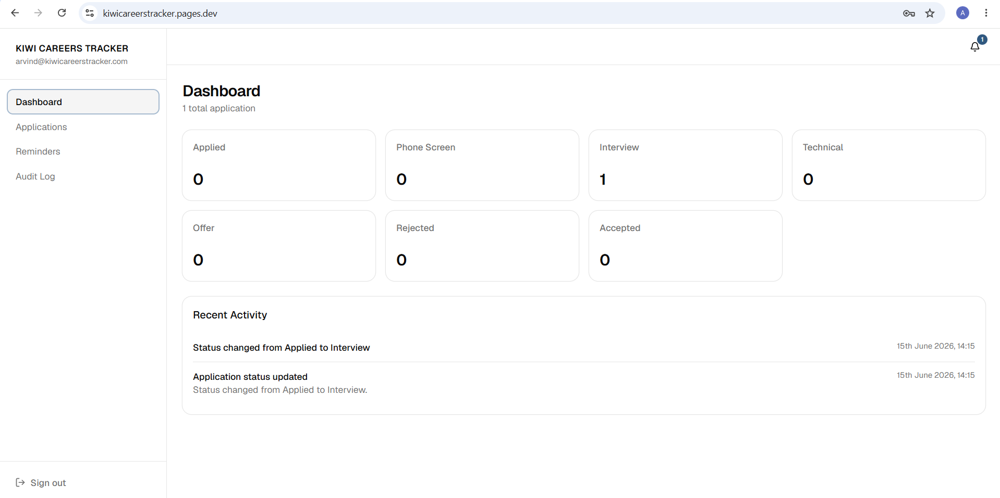
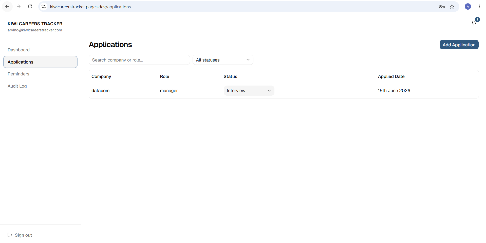
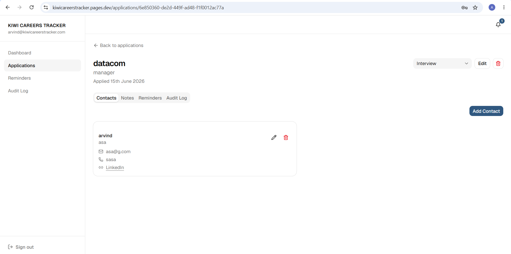
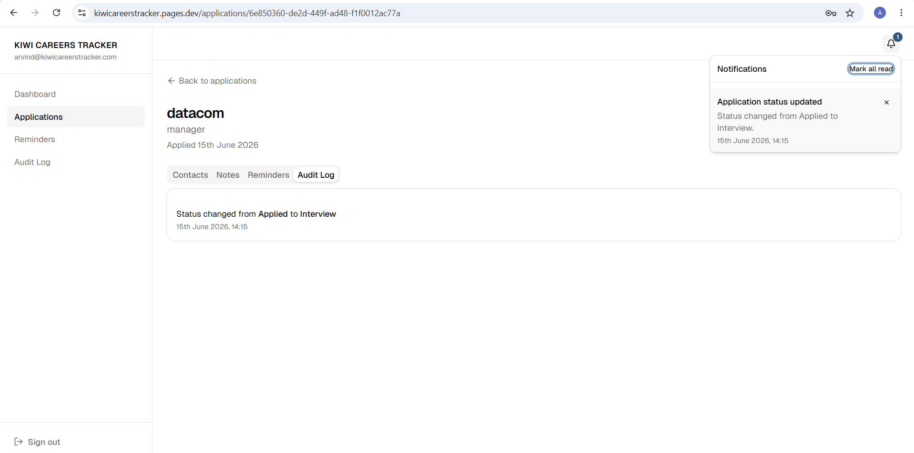
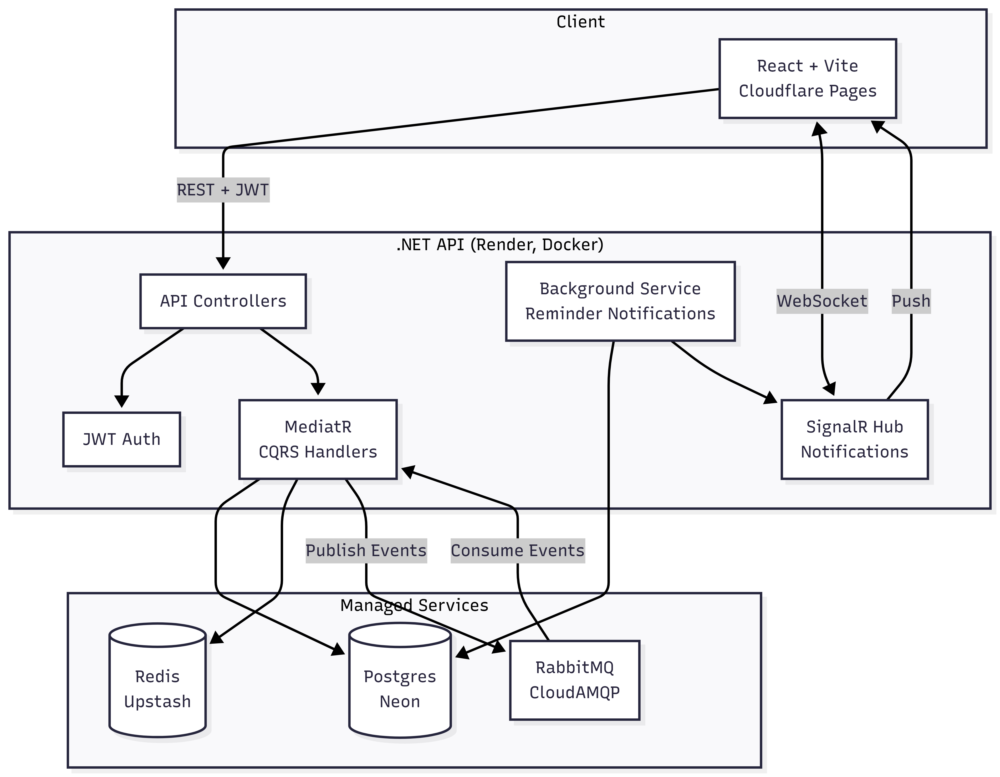

<h1 align="center">Kiwi Careers Tracker</h1>

<p align="center">
  A self-hosted job application tracker — log applications, manage contacts and reminders, and get real-time notifications as your job search progresses.
</p>

<p align="center">
  <a href="https://kiwicareerstracker.pages.dev"><strong>🔗 Live Demo</strong></a> ·
  <a href="https://kiwicareerstracker.onrender.com/scalar">API Docs</a>
</p>

<p align="center">
  <em>Note: the backend is hosted on Render's free tier and may take 30-60s to wake up after a period of inactivity.</em>
</p>

---

## Overview

Kiwi Careers Tracker is a full-stack application for tracking job applications end to end — from "Applied" through to "Offer" or "Rejected". For each application you can track status changes, add contacts, take notes, set due-date reminders, and view a full audit log of everything that happened.

The backend is a **.NET 10 Clean Architecture** API (Domain/Application/Infrastructure/Api) using CQRS via MediatR, with a background service that scans for due reminders and pushes live notifications to the frontend over SignalR.

---

## Features

- **Applications** — track company, role, status, and applied date; sortable/filterable list view
- **Status pipeline** — Applied → Phone Screen → Technical → Offer / Rejected, with full history
- **Contacts** — store recruiter/interviewer details per application
- **Notes** — free-form notes per application
- **Reminders** — set due-date reminders, get notified when they're due
- **Audit Log** — per-application and global activity history
- **Notifications** — live in-app alerts via SignalR for status changes and due reminders
- **Auth** — JWT access/refresh tokens

---

## Screenshots

| Dashboard                                    | Applications                                       |
| -------------------------------------------- | -------------------------------------------------- |
|  |  |

| Application Detail                                            | Live Audits & Reminders                                                 |
| ------------------------------------------------------------- | ----------------------------------------------------------------------- |
|  |  |

---

## Tech Stack

**Backend** — .NET 10, MediatR, EF Core (Npgsql), SignalR, JWT Auth, MassTransit (RabbitMQ), Redis caching, API Versioning + Scalar

**Frontend** — React 19 + Vite + TypeScript, TanStack Query, Zustand, Tailwind + shadcn/ui, React Router, SignalR client, Axios

**Infrastructure** — Neon (Postgres), Upstash (Redis), CloudAMQP (RabbitMQ), Render (backend), Cloudflare Pages (frontend)

---

## Architecture

The backend follows **Clean Architecture**: `Domain` and `Application` hold business logic and CQRS handlers, `Infrastructure` implements persistence/messaging/caching, and `Api` exposes versioned REST endpoints plus a SignalR hub. A background service polls for due reminders and pushes notifications through the same hub.



---

## Getting Started (Local Development)

### Prerequisites

- [.NET 10 SDK](https://dotnet.microsoft.com/download)
- [Node.js 20+](https://nodejs.org/) and npm
- [Docker](https://www.docker.com/) (for local Postgres + RabbitMQ)

### 1. Configure environment variables

Copy `.env.example` to `.env` and adjust values if needed — defaults work out of the box for local development:

```bash
cp .env.example .env
```

### 2. Start local infrastructure

```bash
docker-compose up -d
```

This starts local Postgres (`localhost:5432`) and RabbitMQ (`localhost:5672`, management UI on `15672`).

### 3. Apply database migrations

```bash
dotnet ef database update --project src/JobApplicationTracker.Infrastructure --startup-project src/JobApplicationTracker.Api
```

### 4. Run the backend

```bash
dotnet run --project src/JobApplicationTracker.Api
```

API available at `http://localhost:5158`, with interactive docs at `/scalar`.

### 5. Run the frontend

```bash
cd frontend
npm install
npm run dev
```

Frontend available at `http://localhost:5173`. Set `VITE_API_URL=http://localhost:5158/api/v1` in `frontend/.env.local` if not already configured.

---

## Environment Variables

| Variable                                                             | Description                                                                                  |
| -------------------------------------------------------------------- | -------------------------------------------------------------------------------------------- |
| `ConnectionStrings__Postgres`                                        | Postgres connection string                                                                   |
| `ConnectionStrings__Redis`                                           | Redis connection string                                                                      |
| `RabbitMq__ConnectionString` (or `RabbitMq__Host/Username/Password`) | RabbitMQ connection — full AMQP URI for hosted brokers, or discrete host/user/pass for local |
| `Jwt__Secret` / `Issuer` / `Audience`                                | JWT signing config                                                                           |
| `Cors__AllowedOrigins__0`, `__1`, ...                                | CORS allowed origins (frontend URL(s))                                                       |
| `ApplyMigrationsOnStartup`                                           | If `true`, runs EF Core migrations automatically on startup                                  |
| `VITE_API_URL` (frontend)                                            | Base URL of the backend API                                                                  |

A full reference for local dev is in [`.env.example`](.env.example).

---

## Deployment

- **Backend** — deployed to [Render](https://render.com) as a Docker web service, built from the root `Dockerfile`. The free tier spins down after inactivity, so the first request after idling can take 30-60s while it wakes up.
- **Frontend** — deployed to [Cloudflare Pages](https://pages.cloudflare.com), built from `frontend/` (`npm run build` → `dist`)
- **Database** — [Neon](https://neon.tech) serverless Postgres
- **Cache** — [Upstash](https://upstash.com) Redis
- **Message Broker** — [CloudAMQP](https://www.cloudamqp.com) RabbitMQ

---

## Testing

```bash
# Unit tests
dotnet test tests/JobApplicationTracker.UnitTests

# Integration tests (spins up Postgres via Testcontainers)
dotnet test tests/JobApplicationTracker.IntegrationTests
```

Integration tests use [Testcontainers](https://testcontainers.com/) to run against a real Postgres instance — Docker must be running.
